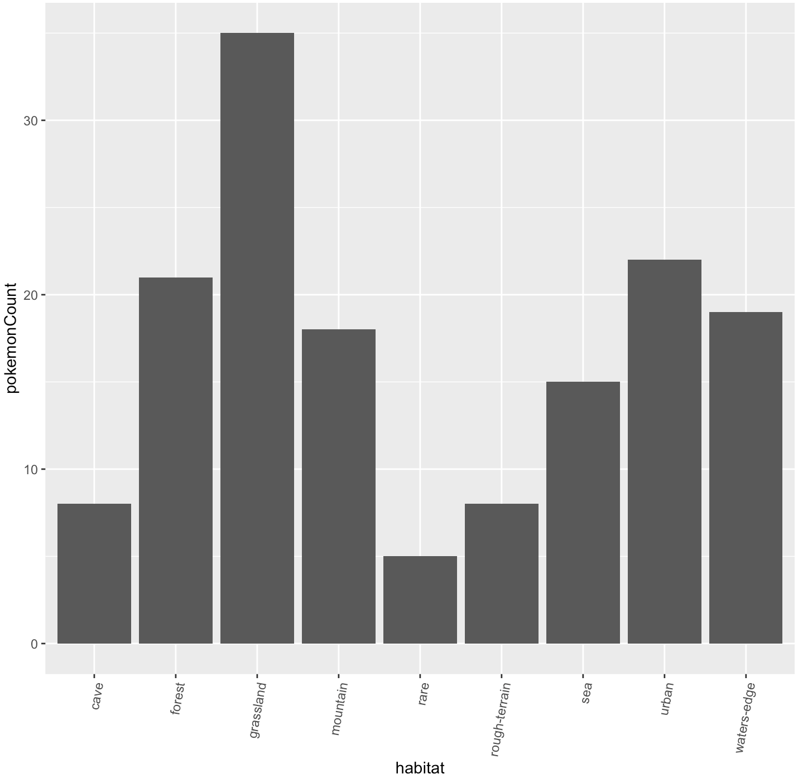

## Pokémon API R Wrapper
##### Authors: Connor Lee and Eva Nguyen

Travis [](https://travis-ci.org/nguyeneva/data534_project)

AppVeyor [](https://ci.appveyor.com/project/nguyeneva/data534_project)


This package provides an R wrapper for the Pokémon API. It is specifically for getting, filtering, and summarizing the following information for each of the generation 1 Pokémon.

  - pokedex index number (idx)
  - pokemon species (pokemon)
  - API URL for pokemon species (speciesURL)
  - habitat
  - type
  - top 5 moves (moves)

More information on the API documentation can be found at the official website: [Poke API](https://pokeapi.co/)

## Installation
Developer GitHub Version
```
library(devtools)
devtools::install_github("nguyeneva/data534_project/pokeWrapper")
```
**Attention**
The `devtools` package will need to be installed.

## Loading  <font size="3">pokeWrapper</font> Library
```
library(pokeWrapper)
```

## <font size="4">pokeframe</font> Data Frame
Before anything can be done a data frame (referred to as a `pokeframe`) storing all of the generation 1 Pokémon needs to be created. A pokeframe can be created using the following commands.

As the `pokeframe` initializes the R Console will show a counter, once the counter reaches 151 (the number of generation 1 pokemon) the `pokeframe` initialization is complete. Expect this initialization to take approximately 4 minutes.
```
pokeframe <- initializeDataFrame()
```
**Sample Output**
```
head(pokeframe)
```
```
##   idx   pokemon                                     speciesURL     habitat
## 1 149 dragonite https://pokeapi.co/api/v2/pokemon-species/149/ waters-edge
## 2 148 dragonair https://pokeapi.co/api/v2/pokemon-species/148/ waters-edge
## 3 143   snorlax https://pokeapi.co/api/v2/pokemon-species/143/    mountain
## 4 141  kabutops https://pokeapi.co/api/v2/pokemon-species/141/         sea
## 5 139   omastar https://pokeapi.co/api/v2/pokemon-species/139/         sea
## 6 136   flareon https://pokeapi.co/api/v2/pokemon-species/136/       urban
##   captureRate           type
## 1          45 flying, dragon
## 2          45         dragon
## 3          25         normal
## 4          45    water, rock
## 5          45    water, rock
## 6          45           fire
##                                                   moves
## 1     fire-punch,ice-punch,thunder-punch,razor-wind,cut
## 2               bind,slam,headbutt,horn-drill,body-slam
## 3 mega-punch,pay-day,fire-punch,ice-punch,thunder-punch
## 4         scratch,razor-wind,swords-dance,cut,mega-kick
## 5        bind,headbutt,horn-attack,horn-drill,body-slam
## 6       sand-attack,headbutt,tackle,body-slam,take-down
```

## Filtering Data Frame <font size="4">poke.filter</font>
Once the pokeframe has been initialized the data can be filtered using the `poke.filter()` function for any generation 1 Pokémon. The first argument is the `pokeframe` and the second argument is either a single Pokémon or a list of Pokémon.

**For example:**
**Filtering individual Pokémon**
```
poke.filter(pokeframe, "jigglypuff")
```
```
##    idx    pokemon                                    speciesURL   habitat
## 58  39 jigglypuff https://pokeapi.co/api/v2/pokemon-species/39/ grassland
##    captureRate          type                                             moves
## 58         170 fairy, normal pound,double-slap,mega-punch,fire-punch,ice-punch
```
**Filtering multiple Pokémon**
```
poke.filter(pokeframe, c("dragonite","snorlax"))
```
```
##   idx   pokemon                                     speciesURL     habitat
## 1 149 dragonite https://pokeapi.co/api/v2/pokemon-species/149/ waters-edge
## 3 143   snorlax https://pokeapi.co/api/v2/pokemon-species/143/    mountain
##   captureRate           type
## 1          45 flying, dragon
## 3          25         normal
##                                                   moves
## 1     fire-punch,ice-punch,thunder-punch,razor-wind,cut
## 3 mega-punch,pay-day,fire-punch,ice-punch,thunder-punch
```
## Incorrect Inputs for the <font size="4">poke.filter</font> Function
If an incorrectly spelled Pokémon name, or a non-generation 1 Pokémon is passed in amoung a list of generation 1 Pokémon then only the correctly spelled, or generation 1 Pokémon will be filtered for, and a message indicating that some of the Pokémon are not from generation 1. If none of the Pokémon passed in are from generation 1 a message indicating this will be printed to the R Console.

If the pokeframe passed into the function is not a data frame then a message will be printed on the R Console indicating that the `pokeframe` must be a data frame.

## Using the <font size="4">poke.summary</font> Function
The `poke.summary()` function can be used to provide a data frame summary for the following information:

- **Habitat:**
  - Count of Pokémon per habitat
  - Mean capture rate per habitat
- **Pokemon Type:**
  - Count of Pokémon per type
  - Mean capture rate per type

**For example:**
**Using habitat option**
```
poke.summary(pokeframe, 'habitat')
```
```
## # A tibble: 9 x 3
##   habitat       pokemonCount meanCaptureRate
##   <chr>                <int>           <dbl>
## 1 cave                     8             128
## 2 forest                  21             126
## 3 grassland               35             111
## 4 mountain                18              94
## 5 rare                     5              11
## 6 rough-terrain            8             140
## 7 sea                     15             105
## 8 urban                   22              88
## 9 waters-edge             19             110
```
**Using type option**
```
poke.summary(pokeframe, 'type')
```
```
## # A tibble: 38 x 3
##    type            pokemonCount meanCaptureRate
##    <chr>                  <int>           <dbl>
##  1 bug                        3             140
##  2 dragon                     2              45
##  3 electric                   6             101
##  4 fairy                      2              88
##  5 fairy, normal              2             110
##  6 fairy, psychic             1              45
##  7 fighting                   7              96
##  8 fighting, water            1              45
##  9 fire                      10              96
## 10 flying, bug                2              45
## # … with 28 more rows
```

## Incorrect Inputs for the <font size="4">poke.summary</font> Function
If an incorrect parameter is passed into the poke.summary function a message will be printed in the R Console stating that the request was invalid.

## Plotting with <font size="4">pokeWrapper</font>
The summary data can be plotted through the following steps:

1. Create a `pokeframe`
2. Run the `poke.summary()` function on the desired parameters and store the resulting data frame
3. Plot the resulting data frame

**Code Example:**
```
pokeframe <- initializeDataFrame()
habitatSummary <- poke.summary(pokeframe, 'habitat')
barplot(habitatSummary$pokemonCount, names.arg=habitatSummary$habitat, las=2,col="#FFCC33")
par(mar=c(7,3,3,0))
mtext(side=3, line=0.5, "Count of Pokemon by Habitat", col="red", font=3, cex=2)
mtext(side=1, line=4.5, "Habitat", col="blue", font=2,cex=1.2)
mtext(side=2, line=2, "Count of Pokemon", col="blue", font=2, cex=1.2)
```

