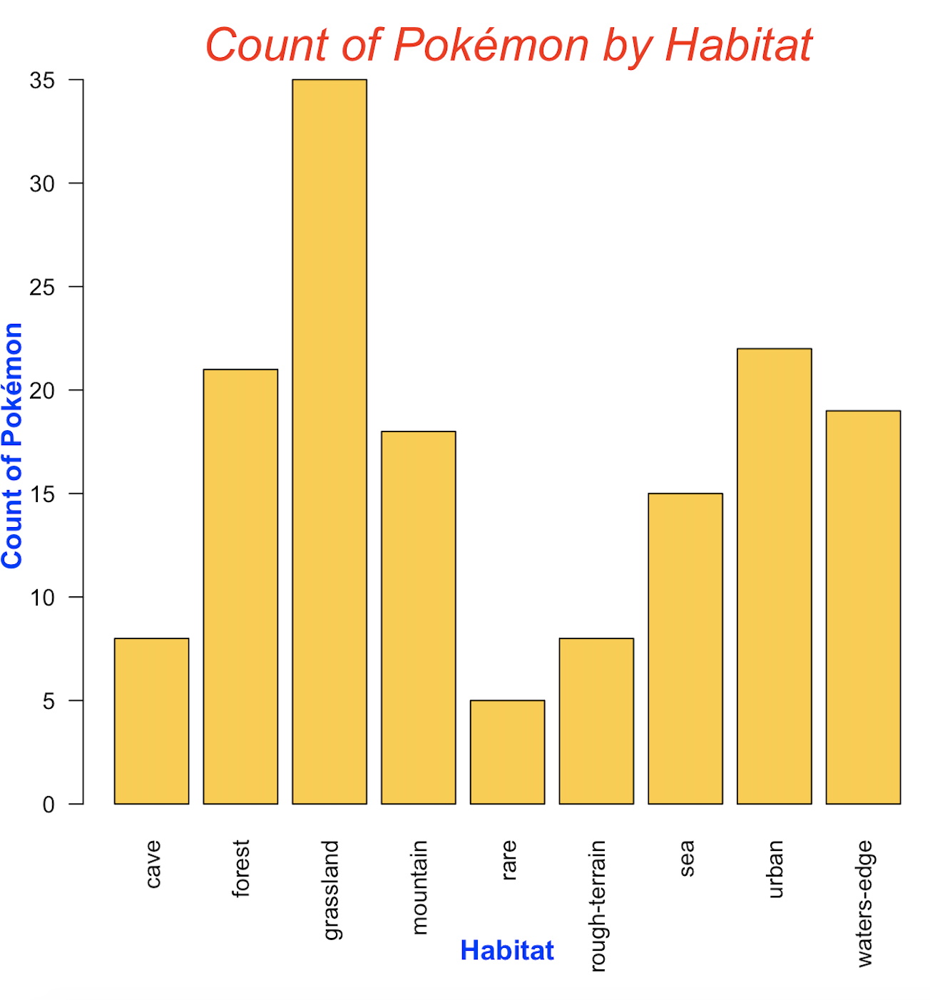

This package provides an R wrapper for the Pokémon API. It is specifically for getting, filtering, and summarizing the following information for each of the generation 1 pokemon.  

  - pokedex index number (idx)
  - pokemon species (pokemon)
  - API URL for pokemon species (speciesURL)
  - habitat
  - type
  - top 5 moves (moves)    
    
More information on the API documentation can be found at the official website: [Poké API](https://pokeapi.co/)

## API Call Methodology 
Created a `poke_api` function to call the Pokémon API. Used the `httr` library to send a simple GET request to the Pokémon API endpoint. The API returns an HTTP response with a status code, headers, and a body in JSON format. An error message is returned if the HTTP response does not return a body in JSON format. The `poke_api` takes a url path as a parameter. URL path for generation 1 is used to complete the GET request. 

```
library(httr)

poke_api <- function(path){
  url <- modify_url("https://pokeapi.co", path=paste("/api/v2",path, sep=""))
  response <- GET(url)

  if (http_type(response) != "application/json"){
    stop("API did not return json", call. = FALSE)
  }
  response
}

pokeList <- poke_api("/generation/1")
```

## Installation 
Developer GitHub Version
```
library(devtools)   
devtools::install_github("nguyeneva/data534_project/pokeWrapper")
```
**Attention**  
The `devtools` package will need to be installed.

## Loading  <font size="3">pokeWrapper</font> Library
```
library(pokeWrapper)
```

## <font size="3">pokeframe</font> Data Frame
Before anything can be done a data frame (referred to as a `pokeframe`) storing all of the generation 1 Pokémon needs to be created. A pokeframe can be created using the following commands.

As the `pokeframe` initializes the R Console will show a counter, once the counter reaches 151 (the number of generation 1 Pokémon) the `pokeframe` initialization is complete. Expect this initialization to take approximately 4 minutes.
```
pokeframe <- initializeDataFrame()
```
```{r, eval=TRUE, include=FALSE}
library(devtools)
devtools::install_github("nguyeneva/data534_project/pokeWrapper")
library(pokeWrapper)
pokeframe <- initializeDataFrame()
```
**Sample Output**   
```{r}
head(pokeframe)
```


## Filtering Data Frame <font size="3">poke.filter</font>
Once the pokeframe has been initialized the data can be filtered using the `poke.filter()` function for any generation 1 Pokémon. The first argument is the `pokeframe` and the second argument is either a single Pokémon or a list of Pokémon.  

**For example:**  
**Filtering individual Pokémon**
```{r}
poke.filter(pokeframe, "jigglypuff")
```

**Filtering multiple Pokémon**
```{r}
poke.filter(pokeframe, c("dragonite","snorlax"))
```

## Incorrect Inputs for the <font size="3">poke.filter</font> Function
If an incorrectly spelled Pokémon name, or a non-generation 1 Pokémon is passed in amoung a list of generation 1 Pokémon then only the correctly spelled, or generation 1 Pokémon will be filtered for, and a message indicating that some of the Pokémon are not from generation 1. If none of the Pokémon passed in are from generation 1 a message indicating this will be printed to the R Console.

If the pokeframe passed into the function is not a data frame then a message will be printed on the R Console indicating that the `pokeframe` must be a data frame.

## Using the <font size="3">poke.summary</font> Function
The `poke.summary()` function can be used to provide a data frame summary for the following information:

- **Habitat:**
  - Count of Pokémon per habitat
  - Mean capture rate per habitat
- **Pokemon Type:**
  - Count of Pokémon per type
  - Mean capture rate per type
  
**For example:**  
**Using habitat option**
```{r}
poke.summary(pokeframe, 'habitat')
```
**Using type option**
```{r}
poke.summary(pokeframe, 'type')
```


## Incorrect Inputs for the <font size="3">poke.summary</font> Function
If an incorrect parameter is passed into the poke.summary function a message will be printed in the R Console stating that the request was invalid.

## Plotting with <font size="3">pokeWrapper</font> 
The summary data can be plotted through the following steps:

1. Create a `pokeframe`
2. Run the `poke.summary()` function on the desired parameters and store the resulting data frame
3. Plot the resulting data frame

**Code Example:**
```{r, eval=FALSE}
pokeframe <- initializeDataFrame()
habitatSummary <- poke.summary(pokeframe, 'habitat')
```


```{r, eval=FALSE}
barplot(habitatSummary$pokemonCount, names.arg=habitatSummary$habitat, las=2,col="#FFCC33")
par(mar=c(7,3,3,0))
mtext(side=3, line=0.5, "Count of Pokémon by Habitat", col="red", font=3, cex=2)
mtext(side=1, line=4.5, "Habitat", col="blue", font=2,cex=1.2)
mtext(side=2, line=2, "Count of Pokémon", col="blue", font=2, cex=1.2)
```



